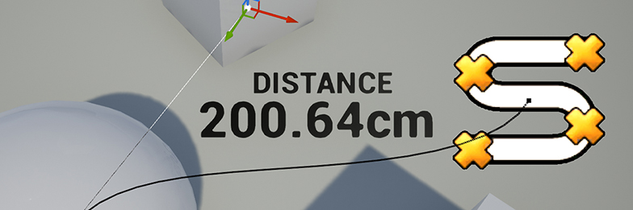

# ue5-measuring-tool
A simple distance measuring tool for Unreal Engine 5, created by Nick Mower.

The full tutorial can be found here: https://www.techarthub.com/how-to-make-a-distance-measurement-tool-in-unreal-engine/

For the Unreal Engine 4 version, go here: https://github.com/techarthub/ue4-measuring-tool

This project is licensed under the Unreal Engine 5 EULA.
